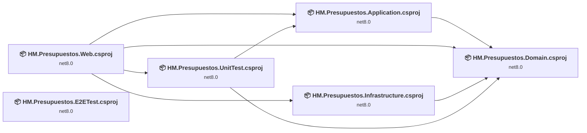
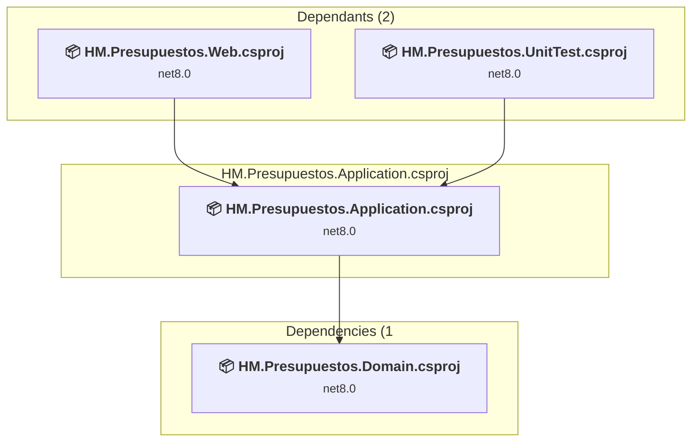
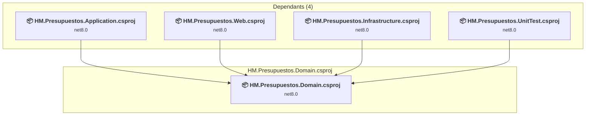
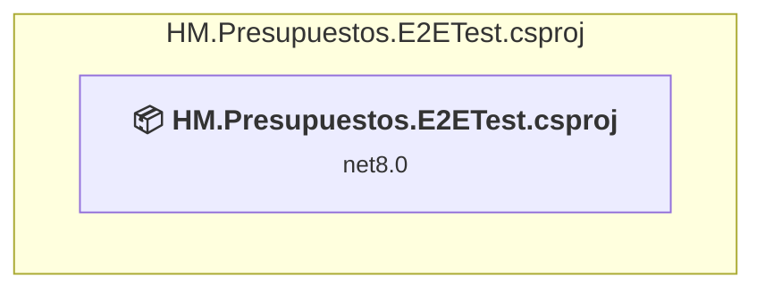
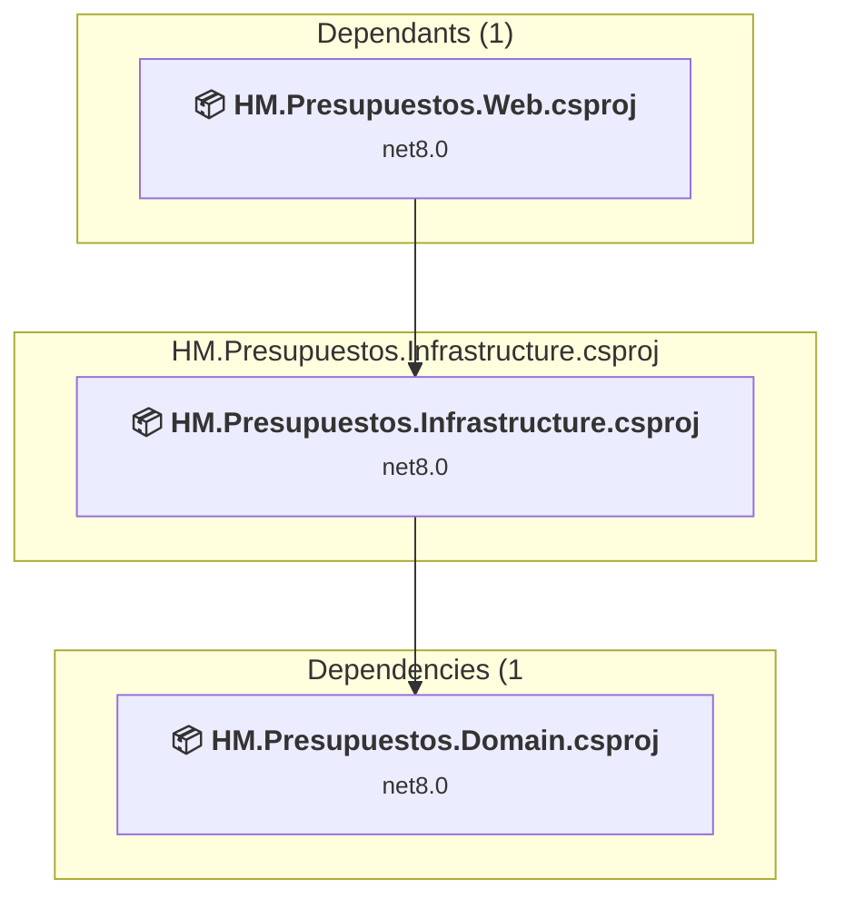
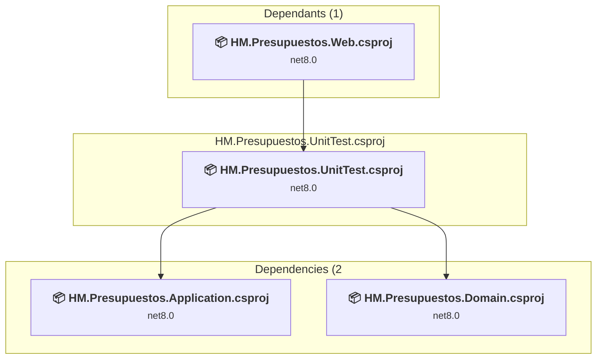
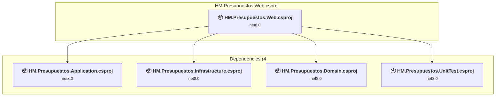

# Projects and dependencies analysis

This document provides a comprehensive overview of the projects and their dependencies in the context of upgrading to .NETCoreApp,Version=v10.0.

## Table of Contents

- [Executive Summary](#executive-Summary)
  - [Highlevel Metrics](#highlevel-metrics)
  - [Projects Compatibility](#projects-compatibility)
  - [Package Compatibility](#package-compatibility)
  - [API Compatibility](#api-compatibility)
- [Aggregate NuGet packages details](#aggregate-nuget-packages-details)
- [Top API Migration Challenges](#top-api-migration-challenges)
  - [Technologies and Features](#technologies-and-features)
  - [Most Frequent API Issues](#most-frequent-api-issues)
- [Projects Relationship Graph](#projects-relationship-graph)
- [Project Details](#project-details)

  - [HM.Presupuestos.Application\HM.Presupuestos.Application.csproj](#hmpresupuestosapplicationhmpresupuestosapplicationcsproj)
  - [HM.Presupuestos.Domain\HM.Presupuestos.Domain.csproj](#hmpresupuestosdomainhmpresupuestosdomaincsproj)
  - [HM.Presupuestos.E2ETest\HM.Presupuestos.E2ETest.csproj](#hmpresupuestose2etesthmpresupuestose2etestcsproj)
  - [HM.Presupuestos.Infrastructure\HM.Presupuestos.Infrastructure.csproj](#hmpresupuestosinfrastructurehmpresupuestosinfrastructurecsproj)
  - [HM.Presupuestos.UnitTest\HM.Presupuestos.UnitTest.csproj](#hmpresupuestosunittesthmpresupuestosunittestcsproj)
  - [HM.Presupuestos.Web\HM.Presupuestos.Web.csproj](#hmpresupuestoswebhmpresupuestoswebcsproj)

## Executive Summary

### Highlevel Metrics

| Metric | Count | Status |
| :--- | :---: | :--- |
| Total Projects | 6 | All require upgrade |
| Total NuGet Packages | 27 | 8 need upgrade |
| Total Code Files | 142 |  |
| Total Code Files with Incidents | 24 |  |
| Total Lines of Code | 21020 |  |
| Total Number of Issues | 72 |  |
| Estimated LOC to modify | 52+ | at least 0,2% of codebase |

### Projects Compatibility

| Project | Target Framework | Difficulty | Package Issues | API Issues | Est. LOC Impact | Description |
| :--- | :---: | :---: | :---: | :---: | :---: | :--- |
| [HM.Presupuestos.Application\HM.Presupuestos.Application.csproj](#hmpresupuestosapplicationhmpresupuestosapplicationcsproj) | net8.0 | 🟢 Low | 2 | 0 |  | ClassLibrary, Sdk Style = True |
| [HM.Presupuestos.Domain\HM.Presupuestos.Domain.csproj](#hmpresupuestosdomainhmpresupuestosdomaincsproj) | net8.0 | 🟢 Low | 1 | 0 |  | ClassLibrary, Sdk Style = True |
| [HM.Presupuestos.E2ETest\HM.Presupuestos.E2ETest.csproj](#hmpresupuestose2etesthmpresupuestose2etestcsproj) | net8.0 | 🟢 Low | 4 | 0 |  | DotNetCoreApp, Sdk Style = True |
| [HM.Presupuestos.Infrastructure\HM.Presupuestos.Infrastructure.csproj](#hmpresupuestosinfrastructurehmpresupuestosinfrastructurecsproj) | net8.0 | 🟢 Low | 1 | 6 | 6+ | ClassLibrary, Sdk Style = True |
| [HM.Presupuestos.UnitTest\HM.Presupuestos.UnitTest.csproj](#hmpresupuestosunittesthmpresupuestosunittestcsproj) | net8.0 | 🟢 Low | 1 | 0 |  | DotNetCoreApp, Sdk Style = True |
| [HM.Presupuestos.Web\HM.Presupuestos.Web.csproj](#hmpresupuestoswebhmpresupuestoswebcsproj) | net8.0 | 🟢 Low | 5 | 46 | 46+ | AspNetCore, Sdk Style = True |

### Package Compatibility

| Status | Count | Percentage |
| :--- | :---: | :---: |
| ✅ Compatible | 19 | 70,4% |
| ⚠️ Incompatible | 0 | 0,0% |
| 🔄 Upgrade Recommended | 8 | 29,6% |
| ***Total NuGet Packages*** | ***27*** | ***100%*** |

### API Compatibility

| Category | Count | Impact |
| :--- | :---: | :--- |
| 🔴 Binary Incompatible | 19 | High - Require code changes |
| 🟡 Source Incompatible | 8 | Medium - Needs re-compilation and potential conflicting API error fixing |
| 🔵 Behavioral change | 25 | Low - Behavioral changes that may require testing at runtime |
| ✅ Compatible | 38132 |  |
| ***Total APIs Analyzed*** | ***38184*** |  |

## Aggregate NuGet packages details

| Package | Current Version | Suggested Version | Projects | Description |
| :--- | :---: | :---: | :--- | :--- |
| ClosedXML | 0.104.2 |  | [HM.Presupuestos.Web.csproj](#hmpresupuestoswebhmpresupuestoswebcsproj) | ✅Compatible |
| coverlet.collector | 6.0.0 |  | [HM.Presupuestos.E2ETest.csproj](#hmpresupuestose2etesthmpresupuestose2etestcsproj) [HM.Presupuestos.UnitTest.csproj](#hmpresupuestosunittesthmpresupuestosunittestcsproj) | ✅Compatible |
| DevExpress.Blazor | 24.2.5 |  | [HM.Presupuestos.Web.csproj](#hmpresupuestoswebhmpresupuestoswebcsproj) | ✅Compatible |
| DevExpress.Blazor.es | 24.2.5 |  | [HM.Presupuestos.Web.csproj](#hmpresupuestoswebhmpresupuestoswebcsproj) | ✅Compatible |
| HM.Core | 6.4.24157.1-unstable |  | [HM.Presupuestos.Application.csproj](#hmpresupuestosapplicationhmpresupuestosapplicationcsproj) [HM.Presupuestos.Infrastructure.csproj](#hmpresupuestosinfrastructurehmpresupuestosinfrastructurecsproj) | ✅Compatible |
| HM.Core.Comun.v6.Pack | 0.1.25086.1-unstable |  | [HM.Presupuestos.Application.csproj](#hmpresupuestosapplicationhmpresupuestosapplicationcsproj) [HM.Presupuestos.Infrastructure.csproj](#hmpresupuestosinfrastructurehmpresupuestosinfrastructurecsproj) | ✅Compatible |
| HM.Core.Servidor.v6.Pack | 0.1.25086.1-unstable |  | [HM.Presupuestos.Infrastructure.csproj](#hmpresupuestosinfrastructurehmpresupuestosinfrastructurecsproj) [HM.Presupuestos.Web.csproj](#hmpresupuestoswebhmpresupuestoswebcsproj) | ✅Compatible |
| Isopoh.Cryptography.Argon2 | 2.0.0 |  | [HM.Presupuestos.Web.csproj](#hmpresupuestoswebhmpresupuestoswebcsproj) | ✅Compatible |
| Microsoft.AspNetCore.Authentication.JwtBearer | 8.0.13 | 10.0.8 | [HM.Presupuestos.Web.csproj](#hmpresupuestoswebhmpresupuestoswebcsproj) | Se recomienda actualizar el paquete NuGet |
| Microsoft.AspNetCore.Authentication.OpenIdConnect | 8.0.13 | 10.0.8 | [HM.Presupuestos.Web.csproj](#hmpresupuestoswebhmpresupuestoswebcsproj) | Se recomienda actualizar el paquete NuGet |
| Microsoft.AspNetCore.Components.WebAssembly.Server | 8.*-* | 10.0.8 | [HM.Presupuestos.Web.csproj](#hmpresupuestoswebhmpresupuestoswebcsproj) | Se recomienda actualizar el paquete NuGet |
| Microsoft.Extensions.Configuration.Binder | 8.0.2 | 10.0.8 | [HM.Presupuestos.E2ETest.csproj](#hmpresupuestose2etesthmpresupuestose2etestcsproj) | Se recomienda actualizar el paquete NuGet |
| Microsoft.Extensions.Configuration.EnvironmentVariables | 8.0.0 | 10.0.8 | [HM.Presupuestos.E2ETest.csproj](#hmpresupuestose2etesthmpresupuestose2etestcsproj) | Se recomienda actualizar el paquete NuGet |
| Microsoft.Extensions.Configuration.Json | 8.0.1 | 10.0.8 | [HM.Presupuestos.E2ETest.csproj](#hmpresupuestose2etesthmpresupuestose2etestcsproj) | Se recomienda actualizar el paquete NuGet |
| Microsoft.Extensions.Localization | 9.0.0 | 10.0.8 | [HM.Presupuestos.Web.csproj](#hmpresupuestoswebhmpresupuestoswebcsproj) | Se recomienda actualizar el paquete NuGet |
| Microsoft.Extensions.Logging | 8.0.1 | 10.0.8 | [HM.Presupuestos.Application.csproj](#hmpresupuestosapplicationhmpresupuestosapplicationcsproj) | Se recomienda actualizar el paquete NuGet |
| Microsoft.Identity.Web | 3.8.4 |  | [HM.Presupuestos.Web.csproj](#hmpresupuestoswebhmpresupuestoswebcsproj) | ✅Compatible |
| Microsoft.Identity.Web.UI | 3.8.4 |  | [HM.Presupuestos.Web.csproj](#hmpresupuestoswebhmpresupuestoswebcsproj) | ✅Compatible |
| Microsoft.IdentityModel.Tokens | 8.9.0 |  | [HM.Presupuestos.Web.csproj](#hmpresupuestoswebhmpresupuestoswebcsproj) | ✅Compatible |
| Microsoft.NET.Test.Sdk | 17.8.0 |  | [HM.Presupuestos.E2ETest.csproj](#hmpresupuestose2etesthmpresupuestose2etestcsproj) [HM.Presupuestos.UnitTest.csproj](#hmpresupuestosunittesthmpresupuestosunittestcsproj) | ✅Compatible |
| Microsoft.Playwright.NUnit | 1.50.0 |  | [HM.Presupuestos.E2ETest.csproj](#hmpresupuestose2etesthmpresupuestose2etestcsproj) | ✅Compatible |
| Moq | 4.20.72 |  | [HM.Presupuestos.UnitTest.csproj](#hmpresupuestosunittesthmpresupuestosunittestcsproj) | ✅Compatible |
| NLog | 5.3.4 |  | [HM.Presupuestos.Web.csproj](#hmpresupuestoswebhmpresupuestoswebcsproj) | ✅Compatible |
| NLog.Extensions.Logging | 5.3.13 |  | [HM.Presupuestos.Web.csproj](#hmpresupuestoswebhmpresupuestoswebcsproj) | ✅Compatible |
| NUnit | 3.14.0 |  | [HM.Presupuestos.E2ETest.csproj](#hmpresupuestose2etesthmpresupuestose2etestcsproj) [HM.Presupuestos.UnitTest.csproj](#hmpresupuestosunittesthmpresupuestosunittestcsproj) | ✅Compatible |
| NUnit.Analyzers | 3.9.0 |  | [HM.Presupuestos.E2ETest.csproj](#hmpresupuestose2etesthmpresupuestose2etestcsproj) [HM.Presupuestos.UnitTest.csproj](#hmpresupuestosunittesthmpresupuestosunittestcsproj) | ✅Compatible |
| NUnit3TestAdapter | 4.5.0 |  | [HM.Presupuestos.E2ETest.csproj](#hmpresupuestose2etesthmpresupuestose2etestcsproj) [HM.Presupuestos.UnitTest.csproj](#hmpresupuestosunittesthmpresupuestosunittestcsproj) | ✅Compatible |

## Top API Migration Challenges

### Technologies and Features

| Technology | Issues | Percentage | Migration Path |
| :--- | :---: | :---: | :--- |

### Most Frequent API Issues

| API | Count | Percentage | Category |
| :--- | :---: | :---: | :--- |
| M:Microsoft.Extensions.Configuration.ConfigurationBinder.GetValue''1(Microsoft.Extensions.Configuration.IConfiguration,System.String) | 18 | 34,6% | Binary Incompatible |
| T:System.Text.Json.JsonDocument | 7 | 13,5% | Behavioral Change |
| T:System.Net.Http.HttpContent | 6 | 11,5% | Behavioral Change |
| T:System.Uri | 6 | 11,5% | Behavioral Change |
| M:System.TimeSpan.FromSeconds(System.Double) | 4 | 7,7% | Source Incompatible |
| P:System.Uri.AbsolutePath | 3 | 5,8% | Behavioral Change |
| M:Microsoft.AspNetCore.Builder.ExceptionHandlerExtensions.UseExceptionHandler(Microsoft.AspNetCore.Builder.IApplicationBuilder,System.String,System.Boolean) | 2 | 3,8% | Behavioral Change |
| M:System.TimeSpan.FromMinutes(System.Double) | 2 | 3,8% | Source Incompatible |
| M:System.Uri.#ctor(System.String) | 1 | 1,9% | Behavioral Change |
| M:Microsoft.Extensions.DependencyInjection.OptionsConfigurationServiceCollectionExtensions.Configure''1(Microsoft.Extensions.DependencyInjection.IServiceCollection,Microsoft.Extensions.Configuration.IConfiguration) | 1 | 1,9% | Binary Incompatible |
| T:Microsoft.AspNetCore.Authentication.OpenIdConnect.OpenIdConnectDefaults | 1 | 1,9% | Source Incompatible |
| F:Microsoft.AspNetCore.Authentication.OpenIdConnect.OpenIdConnectDefaults.AuthenticationScheme | 1 | 1,9% | Source Incompatible |

## Projects Relationship Graph

Legend:
📦 SDK-style project
⚙️ Classic project

## Project Details

### HM.Presupuestos.Application\HM.Presupuestos.Application.csproj

#### Project Info

- **Current Target Framework:** net8.0
- **Proposed Target Framework:** net10.0
- **SDK-style**: True
- **Project Kind:** ClassLibrary
- **Dependencies**: 1
- **Dependants**: 2
- **Number of Files**: 17
- **Number of Files with Incidents**: 2
- **Lines of Code**: 2443
- **Estimated LOC to modify**: 0+ (at least 0,0% of the project)

#### Dependency Graph

Legend:
📦 SDK-style project
⚙️ Classic project

### API Compatibility

| Category | Count | Impact |
| :--- | :---: | :--- |
| 🔴 Binary Incompatible | 0 | High - Require code changes |
| 🟡 Source Incompatible | 0 | Medium - Needs re-compilation and potential conflicting API error fixing |
| 🔵 Behavioral change | 0 | Low - Behavioral changes that may require testing at runtime |
| ✅ Compatible | 1081 |  |
| ***Total APIs Analyzed*** | ***1081*** |  |

### HM.Presupuestos.Domain\HM.Presupuestos.Domain.csproj

#### Project Info

- **Current Target Framework:** net8.0
- **Proposed Target Framework:** net10.0
- **SDK-style**: True
- **Project Kind:** ClassLibrary
- **Dependencies**: 0
- **Dependants**: 4
- **Number of Files**: 48
- **Number of Files with Incidents**: 2
- **Lines of Code**: 1922
- **Estimated LOC to modify**: 0+ (at least 0,0% of the project)

#### Dependency Graph

Legend:
📦 SDK-style project
⚙️ Classic project

### API Compatibility

| Category | Count | Impact |
| :--- | :---: | :--- |
| 🔴 Binary Incompatible | 0 | High - Require code changes |
| 🟡 Source Incompatible | 0 | Medium - Needs re-compilation and potential conflicting API error fixing |
| 🔵 Behavioral change | 0 | Low - Behavioral changes that may require testing at runtime |
| ✅ Compatible | 1639 |  |
| ***Total APIs Analyzed*** | ***1639*** |  |

### HM.Presupuestos.E2ETest\HM.Presupuestos.E2ETest.csproj

#### Project Info

- **Current Target Framework:** net8.0
- **Proposed Target Framework:** net10.0
- **SDK-style**: True
- **Project Kind:** DotNetCoreApp
- **Dependencies**: 0
- **Dependants**: 0
- **Number of Files**: 8
- **Number of Files with Incidents**: 2
- **Lines of Code**: 250
- **Estimated LOC to modify**: 0+ (at least 0,0% of the project)

#### Dependency Graph

Legend:
📦 SDK-style project
⚙️ Classic project

### API Compatibility

| Category | Count | Impact |
| :--- | :---: | :--- |
| 🔴 Binary Incompatible | 0 | High - Require code changes |
| 🟡 Source Incompatible | 0 | Medium - Needs re-compilation and potential conflicting API error fixing |
| 🔵 Behavioral change | 0 | Low - Behavioral changes that may require testing at runtime |
| ✅ Compatible | 472 |  |
| ***Total APIs Analyzed*** | ***472*** |  |

### HM.Presupuestos.Infrastructure\HM.Presupuestos.Infrastructure.csproj

#### Project Info

- **Current Target Framework:** net8.0
- **Proposed Target Framework:** net10.0
- **SDK-style**: True
- **Project Kind:** ClassLibrary
- **Dependencies**: 1
- **Dependants**: 1
- **Number of Files**: 12
- **Number of Files with Incidents**: 3
- **Lines of Code**: 3807
- **Estimated LOC to modify**: 6+ (at least 0,2% of the project)

#### Dependency Graph

Legend:
📦 SDK-style project
⚙️ Classic project

### API Compatibility

| Category | Count | Impact |
| :--- | :---: | :--- |
| 🔴 Binary Incompatible | 0 | High - Require code changes |
| 🟡 Source Incompatible | 0 | Medium - Needs re-compilation and potential conflicting API error fixing |
| 🔵 Behavioral change | 6 | Low - Behavioral changes that may require testing at runtime |
| ✅ Compatible | 4465 |  |
| ***Total APIs Analyzed*** | ***4471*** |  |

### HM.Presupuestos.UnitTest\HM.Presupuestos.UnitTest.csproj

#### Project Info

- **Current Target Framework:** net8.0
- **Proposed Target Framework:** net10.0
- **SDK-style**: True
- **Project Kind:** DotNetCoreApp
- **Dependencies**: 2
- **Dependants**: 1
- **Number of Files**: 4
- **Number of Files with Incidents**: 2
- **Lines of Code**: 221
- **Estimated LOC to modify**: 0+ (at least 0,0% of the project)

#### Dependency Graph

Legend:
📦 SDK-style project
⚙️ Classic project

### API Compatibility

| Category | Count | Impact |
| :--- | :---: | :--- |
| 🔴 Binary Incompatible | 0 | High - Require code changes |
| 🟡 Source Incompatible | 0 | Medium - Needs re-compilation and potential conflicting API error fixing |
| 🔵 Behavioral change | 0 | Low - Behavioral changes that may require testing at runtime |
| ✅ Compatible | 358 |  |
| ***Total APIs Analyzed*** | ***358*** |  |

### HM.Presupuestos.Web\HM.Presupuestos.Web.csproj

#### Project Info

- **Current Target Framework:** net8.0
- **Proposed Target Framework:** net10.0
- **SDK-style**: True
- **Project Kind:** AspNetCore
- **Dependencies**: 4
- **Dependants**: 0
- **Number of Files**: 2264
- **Number of Files with Incidents**: 13
- **Lines of Code**: 12377
- **Estimated LOC to modify**: 46+ (at least 0,4% of the project)

#### Dependency Graph

Legend:
📦 SDK-style project
⚙️ Classic project

### API Compatibility

| Category | Count | Impact |
| :--- | :---: | :--- |
| 🔴 Binary Incompatible | 19 | High - Require code changes |
| 🟡 Source Incompatible | 8 | Medium - Needs re-compilation and potential conflicting API error fixing |
| 🔵 Behavioral change | 19 | Low - Behavioral changes that may require testing at runtime |
| ✅ Compatible | 30117 |  |
| ***Total APIs Analyzed*** | ***30163*** |  |

