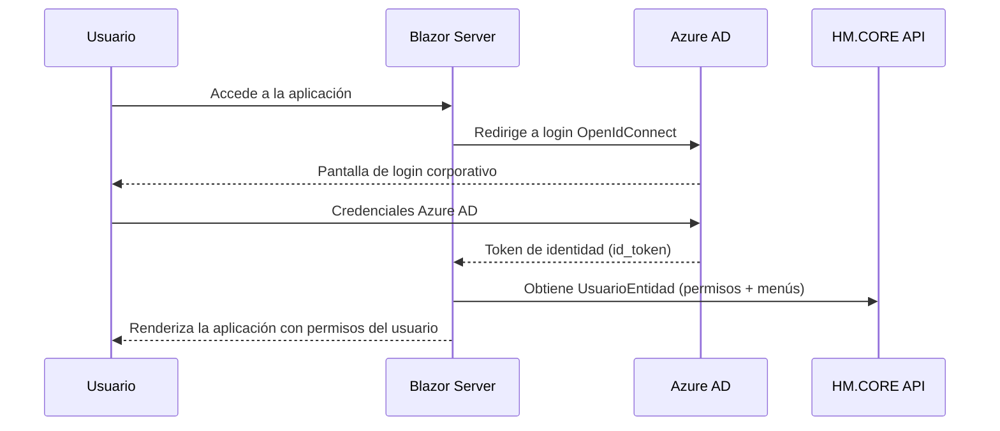

# HM.Presupuestos

[](https://dotnet.microsoft.com/)
[](https://dotnet.microsoft.com/apps/aspnet/web-apps/blazor)
[](https://www.devexpress.com/blazor/)
[](https://learn.microsoft.com/azure/active-directory/)

Aplicación web de gestión de presupuestos construida con **Blazor Server** y **arquitectura hexagonal**, con autenticación SSO vía Azure AD.

---

## Stack Tecnológico

| Capa | Tecnología |
|------|------------|
| Runtime | .NET 10 |
| Frontend | Blazor Server (Interactive Server Components) |
| Componentes UI | DevExpress Blazor (DxGrid, DxPopup, DxFormLayout, DxTreeView...) |
| Autenticación | Azure AD SSO — Microsoft.Identity.Web + OpenIdConnect |
| Tests E2E | Playwright + NUnit |
| Logging | NLog + API HM.CORE |

---

## Requisitos previos

- [.NET 10 SDK](https://dotnet.microsoft.com/download/dotnet/10.0)
- Acceso a Azure AD (tenant configurado en `appsettings.json`)
- Acceso a la API HM.CORE (URL configurada en `appsettings.json`)
- Visual Studio 2026 / VS Code con extensión C# Dev Kit

> **Nuevo en el equipo?** Consulta la [guía completa de configuración del entorno](.github/setup.md) — incluye configuración de Azure AD, Oracle, tests E2E y GitHub Copilot/OpenSpec.

---

## Inicio rápido

```bash
# Clonar el repositorio
git clone <url-repositorio>
cd ESFNN-PresupuestosWeb

# Restaurar dependencias
dotnet restore

# Arrancar la aplicación web
dotnet run --project HM.Presupuestos.Web
```

La aplicación estará disponible en `https://localhost:7001`.

> **Nota:** La primera vez redirigirá al login de Azure AD. Se necesita una cuenta con acceso al tenant configurado.

---

## Arquitectura

El proyecto sigue **arquitectura hexagonal (Ports & Adapters)** organizada en cuatro proyectos:

```
Web → Application → Domain ← Infrastructure
```

```
HM.Presupuestos.Domain/          → Entidades, enums, excepciones de dominio
├── Entidades/                   → Modelos de negocio por módulo
├── Compartido/                  → Constantes, enumerados, excepciones
└── Puertos/Repositorios/        → IXxxRepository (contratos de persistencia)

HM.Presupuestos.Application/     → Casos de uso
└── CasosDeUso/
    ├── Condiciones/             → ICondicionesService + CondicionesService
    ├── Versiones/
    ├── Sobreprimas/
    ├── Indicadores/
    └── ...

HM.Presupuestos.Infrastructure/  → Adaptadores secundarios
└── Persistencia/
    ├── Condiciones/             → CondicionesRepository (implementa ICondicionesRepository)
    └── ...                      → Acceso a la API HM.CORE

HM.Presupuestos.Web/             → Adaptadores primarios (Blazor Server)
├── Pages/                       → Páginas Blazor por módulo de negocio
├── Componentes/                 → Componentes reutilizables
└── Layout/                      → Layout principal y menú lateral
```

### Reglas de dependencia — nunca romper

- ❌ `Web` no importa de `Infrastructure` (salvo `Program.cs` como Composition Root)
- ❌ `Application` no importa de `Infrastructure` ni `Web`
- ❌ `Domain` no referencia ningún otro proyecto de la solución
- ✅ Solo `Web/Program.cs` conoce todas las capas para registrar las dependencias en DI

---

## Flujo de autenticación SSO



### Persistencia de sesión ante F5

La sesión se almacena en `ProtectedSessionStorage` (cifrado automático ASP.NET Core). Al reconectar el circuito Blazor tras un F5, `InicializarUsuarioAsync` rehidrata el usuario desde el storage sin necesidad de re-autenticar.

---

## Estructura de módulos de negocio

Cada módulo sigue la misma estructura en todas las capas:

| Módulo | Descripción |
|--------|-------------|
| Condiciones | Gestión de condiciones comerciales y vigencias |
| Versiones | Control de versiones de presupuestos |
| Sobreprimas | Gestión de sobreprimas |
| Indicadores | Indicadores y métricas |
| Admin | Administración de usuarios, impersonación, configuración |
| LogAcciones | Auditoría de acciones de usuario |
| Favoritos | Gestión de favoritos y preferencias de UI |

---

## Build y Tests

### Compilar

```bash
# Compilar toda la solución
dotnet build HM.Presupuestos.sln

# Compilar solo la web
dotnet build HM.Presupuestos.Web/HM.Presupuestos.Web.csproj
```

### Tests unitarios

```bash
# Ejecutar todos los tests unitarios
dotnet test HM.Presupuestos.UnitTest/HM.Presupuestos.UnitTest.csproj

# O con el script de PowerShell del repositorio
.\RunUnitTests.ps1
```

### Tests E2E (Playwright)

Los tests E2E requieren una sesión SSO guardada:

```powershell
# 1. Generar sesión de autenticación (una sola vez)
cd HM.Presupuestos.E2ETest
.\GuardarSesion.ps1

# 2. Arrancar la aplicación
dotnet run --project ..\HM.Presupuestos.Web

# 3. Ejecutar los tests E2E
dotnet test HM.Presupuestos.E2ETest\HM.Presupuestos.E2ETest.csproj
```

> La URL base de los tests E2E se configura en `HM.Presupuestos.E2ETest/appsettings.json` → sección `E2ETest:BaseUrl` (por defecto `https://localhost:7001`).

---

## Configuración

Los ficheros `appsettings.json` y `appsettings.{Entorno}.json` controlan:

| Sección | Descripción |
|---------|-------------|
| `AzureAd` | Tenant, ClientId, ClientSecret para SSO |
| `HMCore` | URL base de la API HM.CORE |
| `E2ETest:BaseUrl` | URL base para los tests E2E |

El entorno se selecciona mediante la variable de entorno `ASPNETCORE_ENVIRONMENT` (`_DEV_`, `_PRU_`, `_PRE_`, `_PRO_`).

---

## Convenciones de desarrollo

Consultar la documentación interna en `.github/`:

| Documento | Contenido |
|-----------|-----------|
| `.github/copilot-instructions.md` | Convenciones rápidas de código y componentes |
| `.github/specs/technical-specs.md` | Especificaciones técnicas completas |
| `.github/skills/guidelines/architecture-hexagonal/SKILL.md` | Guía de arquitectura hexagonal |
| `.github/prompts/anadir-traduccion.prompt.md` | Proceso para añadir textos traducibles |

### Principios clave

- Las páginas Blazor heredan de `ContextProtegido` o `Context` (nunca de `ComponentBase`)
- El usuario se obtiene en `OnUsuarioDisponibleAsync()`, nunca en `OnInitializedAsync()`
- Toda operación async se envuelve en `EjecutarAsync(async () => { ... })`
- Inyección con `[Inject]` en `.razor.cs`, nunca `@inject` en `.razor`
- Textos UI siempre con `ObtenerTexto(TextosApp.Seccion.Clave)` — sin strings literales
- Auditoría registrada desde el servicio (Application), nunca desde la página