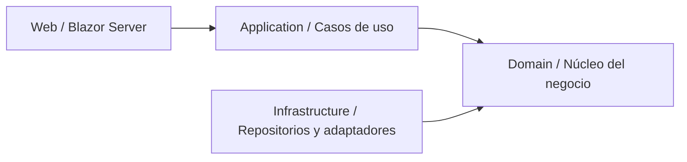
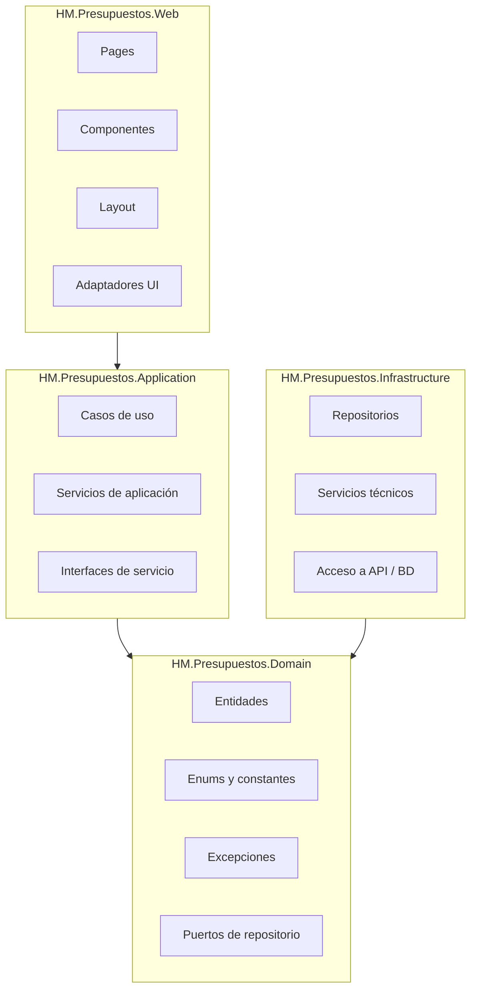
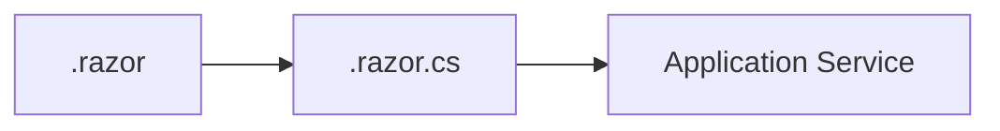
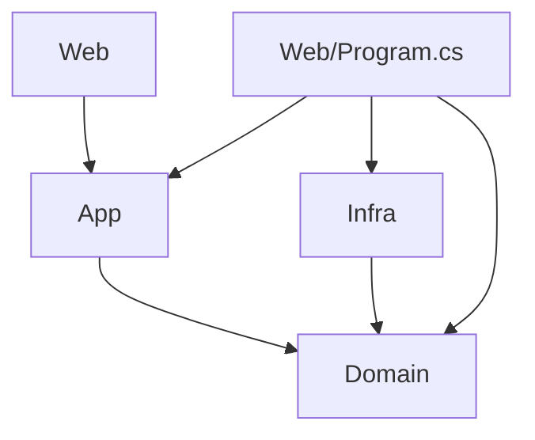
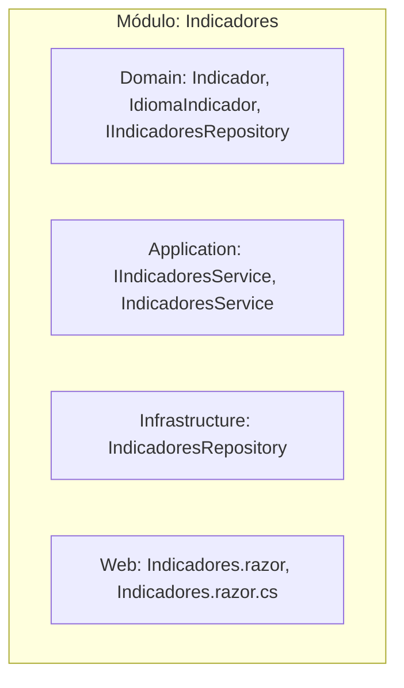
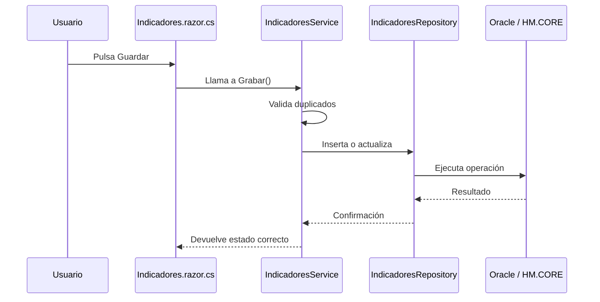

# Arquitectura Hexagonal de HM.Presupuestos

## Propósito del documento

Este documento explica de forma clara y práctica cómo está organizada la solución, qué responsabilidad tiene cada capa y cómo se comunican entre sí. Está pensado para que una persona que se incorpora al proyecto pueda entender rápidamente dónde va cada cosa y qué reglas no debe romper.

## Resumen ejecutivo

La solución sigue arquitectura hexagonal, también conocida como Ports & Adapters. La idea central es aislar el negocio de la tecnología concreta: el dominio contiene las reglas de negocio, la aplicación orquesta los casos de uso, la infraestructura implementa el acceso a datos y la web actúa como entrada principal del usuario.

La dirección de dependencias siempre apunta hacia el centro:



## Capas de la solución



## 1. Domain, el núcleo del negocio

Esta es la capa más importante. Aquí viven las entidades, los puertos de persistencia, los enums, las constantes y las excepciones de dominio. No depende de ninguna otra capa.

### Qué contiene

- Entidades de negocio como `Indicador`, `Version`, `Condicion`, `Sobreprima`.
- Objetos de soporte como `CodigoDescripcion`.
- Enumerados como `EstadoEntidad`, `AccionesLog`, `CampoErrorValidacion`.
- Constantes compartidas.
- Excepciones de negocio como `ValidacionException`.
- Interfaces de repositorio, por ejemplo `IIndicadoresRepository` o `IVersionesRepository`.

### Qué hace

- Define el modelo conceptual del sistema.
- Expresa reglas de negocio.
- Declara contratos que otras capas deben cumplir.

### Qué no hace

- No habla con base de datos.
- No llama a APIs externas.
- No conoce Blazor.
- No conoce detalles técnicos de infraestructura.

### Regla clave

Si una pieza de información forma parte del negocio puro, pertenece al dominio. Si es un contrato que el dominio necesita para persistir o consultar, también puede vivir aquí como puerto.

## 2. Application, los casos de uso

Esta capa orquesta el flujo de negocio. Usa las entidades del dominio y llama a los puertos definidos por el dominio. Aquí viven los servicios de aplicación.

### Qué contiene

- `IXxxService` e `XxxService`.
- Lógica de orquestación de operaciones.
- Validaciones de flujo de caso de uso.
- Registro de auditoría después de una operación exitosa, cuando aplica.
- Coordinación entre repositorios y otros servicios de aplicación.

### Qué hace

- Decide el orden de ejecución de las operaciones.
- Aplica la lógica de caso de uso.
- Llama al repositorio correcto.
- Coordina otras dependencias de aplicación cuando hace falta.

### Qué no hace

- No implementa acceso a BD.
- No contiene UI.
- No conoce Blazor.
- No debería contener SQL.

### Regla importante

Un servicio de aplicación solo debe inyectar su propio repositorio y, si lo necesita, otros servicios de aplicación. No debe inyectar repositorios ajenos a su módulo.

## 3. Infrastructure, los adaptadores secundarios

Esta capa implementa los contratos definidos por el dominio y resuelve el acceso a sistemas externos.

### Qué contiene

- Repositorios concretos.
- Acceso a Oracle o a la API HM.CORE.
- Wrappers técnicos.
- Implementaciones de servicios de soporte técnico como transacciones o cliente HTTP.

### Qué hace

- Traduce contratos del dominio a tecnología concreta.
- Ejecuta consultas.
- Mapea resultados técnicos a entidades o DTOs.
- Gestiona detalles de red, autenticación o acceso a datos.

### Qué no hace

- No contiene reglas de negocio.
- No toma decisiones funcionales.
- No debe ser llamada directamente desde la UI.

### Regla importante

Infrastructure implementa, pero no decide. La decisión funcional está arriba, en Application y Domain.

## 4. Web, los adaptadores primarios

Esta capa es la puerta de entrada del usuario. En este proyecto se implementa con Blazor Server y DevExpress.

### Qué contiene

- Páginas `.razor` y su code-behind `.razor.cs`.
- Componentes reutilizables.
- Layouts.
- Adaptadores de UI.
- ViewModels específicos de pantalla cuando son necesarios.

### Qué hace

- Recibe interacción del usuario.
- Llama a servicios de aplicación.
- Presenta datos.
- Gestiona estado visual, filtros, grids, popups y mensajes.

### Qué no hace

- No contiene lógica de negocio.
- No accede directamente a repositorios.
- No debe registrar auditoría.
- No debe conocer Infrastructure salvo en `Program.cs` para configurar DI.

### Patrón de páginas Blazor

Las páginas siguen el patrón code-behind:



El markup muestra la interfaz. El code-behind controla el estado, el ciclo de vida y las llamadas a servicios.

## Reglas de dependencia

La arquitectura se mantiene correcta solo si se respetan estas reglas:

1. `Domain` no referencia ningún otro proyecto.
2. `Application` referencia `Domain`, pero no `Infrastructure` ni `Web`.
3. `Infrastructure` referencia `Domain`.
4. `Web` referencia `Application` y `Domain`.
5. Solo `Web/Program.cs` conoce todas las capas para registrar dependencias.



## Puertos y adaptadores

La solución usa el patrón de puertos y adaptadores de esta forma:

- Puertos secundarios: interfaces de repositorio en `Domain`.
- Adaptadores secundarios: repositorios concretos en `Infrastructure`.
- Adaptadores primarios: páginas Blazor en `Web`.
- Puertos primarios: servicios de aplicación en `Application`.

### Idea simple

- El dominio define qué necesita.
- La infraestructura responde a esa necesidad.
- La web inicia la interacción.
- La aplicación coordina el caso de uso.

## Estructura por módulos de negocio

La solución no se organiza solo por tipo técnico, sino por módulo funcional.

Ejemplos de módulos:

- Condiciones
- Versiones
- Sobreprimas
- Indicadores
- LogAcciones
- Admin
- Configuracion
- Favoritos

Cada módulo repite el mismo patrón en las capas:



Esta consistencia hace que sea muy fácil moverse por el proyecto.

## Flujo de una operación típica

Ejemplo: guardar un indicador.



## Páginas Blazor

Las páginas siguen estas reglas:

- `ContextProtegido` para páginas con permisos.
- `Context` para componentes o páginas sin control de acceso.
- La carga inicial de datos va en `InicializarPaginaAsync()`.
- Las operaciones de UI van envueltas en `EjecutarAsync(...)`.
- Las dependencias se inyectan en `.razor.cs` con `[Inject]`.
- Los textos visibles se obtienen con `ObtenerTexto(...)`.
- No se usa `OnInitializedAsync()` para lógica que depende del usuario.

### Estructura típica de una página

```csharp
public partial class Versiones : ContextProtegido
{
    [Inject] protected IVersionesService VersionesService { get; set; } = default!;

    private List<Version> _listVersion = [];
    private Version? _versionSeleccionada;

    protected override async Task InicializarPaginaAsync()
    {
        _listVersion = await VersionesService.ObtenerVersiones(...);
    }
}
```

## Tests y validación

La estrategia de tests sigue esta línea:

- Tests unitarios para Application y dominio.
- Tests de integración para repositorios reales.
- E2E para flujos críticos de usuario.

En este proyecto, los tests unitarios de Application pueden usar repositorios in-memory cuando la lógica a validar vive en el caso de uso. Si la lógica pertenece al adaptador SQL, corresponde integración real.

## Qué debe recordar una persona nueva

1. El dominio es el centro del sistema.
2. La aplicación coordina los casos de uso.
3. La infraestructura implementa detalles técnicos.
4. La web solo orquesta interacción con el usuario.
5. Las dependencias siempre apuntan hacia dentro.
6. Un módulo funcional se repite con la misma estructura en todas las capas.
7. La UI no habla con repositorios.
8. Los repositorios no contienen reglas de negocio.
9. Los casos de uso no conocen detalles de Oracle.
10. La consistencia del nombre y la carpeta facilita el mantenimiento.

## Conclusión

Esta solución aplica arquitectura hexagonal para mantener el negocio aislado de la tecnología, facilitar tests, reducir acoplamiento y hacer el sistema más mantenible. Si un programador nuevo sigue estas reglas, podrá ubicar rápidamente cada responsabilidad y trabajar sin romper la estructura general.

## Anexo: relación con los documentos del proyecto

- Guía principal de arquitectura: [`.github/skills/guidelines/architecture-hexagonal/SKILL.md`](../.github/skills/guidelines/architecture-hexagonal/SKILL.md)
- Estructura de módulos: [`.github/skills/guidelines/architecture-hexagonal/references/module-structure.md`](../.github/skills/guidelines/architecture-hexagonal/references/module-structure.md)
- Especificaciones técnicas: [`.github/specs/technical-specs.md`](../.github/specs/technical-specs.md)
- README principal del proyecto: [README.md](../README.md)
